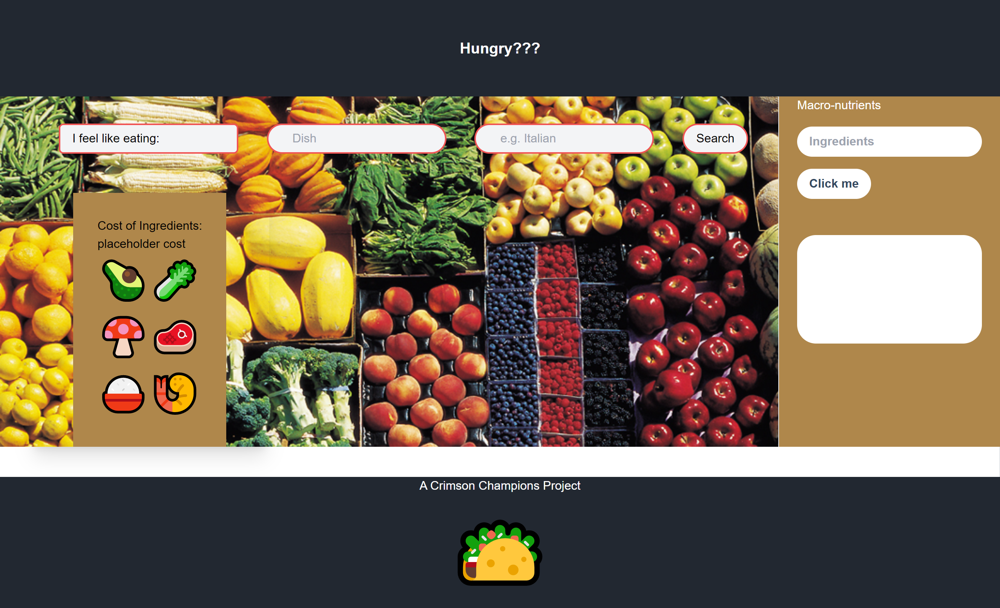

# Hungry?

## Description

When we are hungry, there's so many choices that we often can't decide what to eat. 
You can make something at home, order delivery, or even go to a resturant.
Things can get more complicated when nutritional value or calories are considered. 
Our website makes it simple to look up dishes, ingredients, nutrient information, and even their prices. 
How about you click on the link and check it out?
   

## How does it work?

The website provides meal options when you're indecisive. 
Just search for a dish and cusine and pick from several options. 
Once settled on a dish, you can click on it to see the ingredients and the price (**prices may vary**).
There is also a search bar for nutritional information like the amount of carbohydrates. 
   

--Link to website goes here--
  

## Collaborators

[Rashida Kapaida](https://github.com/rashida53)

[Jacob Garrett](https://github.com/Jake3399)

[Tim Fleck](https://github.com/Chuca78)

[Pedro Hernandez](https://github.com/PedroHzd)

[Frederick Hubbard](https://github.com/f4stfreddy)

[Cayson Bond](https://github.com/C-Bond21)

